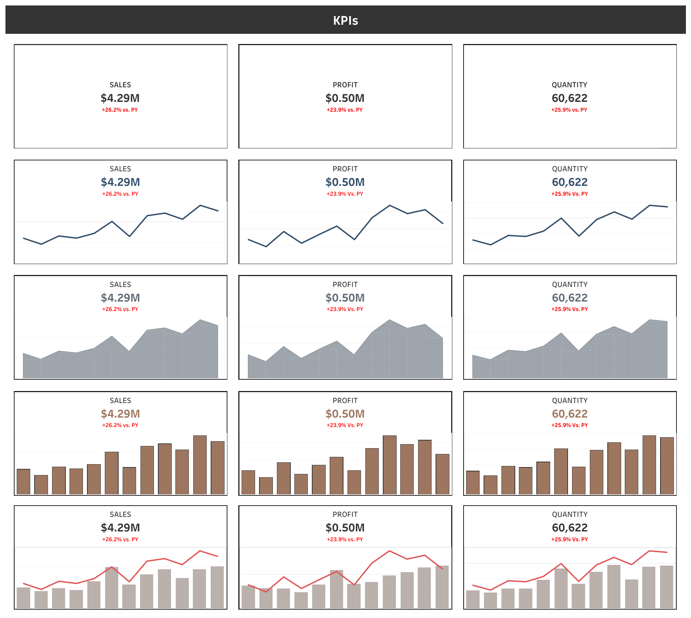

# Multi-Metric-KPI-Dashboard
This project presents a **KPI dashboard built in Tableau** that tracks and compares key metrics such as **Sales**, **Profit**, and **Quantity** over time. The dashboard includes multiple visualizations to compare current year values against previous year performance.

## KPIs Tracked
-  **Sales:** $4.29M (+26.2% vs. PY)
-  **Profit:** $0.50M (+23.9% vs. PY)
-  **Quantity Sold:** 60,622 (+25.9% vs. PY)

## Chart Types Used
- Line Charts
- Area Charts
- Bar Charts
- Combo (Bar + Line) Charts

## 📸 Dashboard Preview

> Or you can view the dashboard live on [Tableau Public](https://public.tableau.com/app/profile/naina.sonkar/viz/Multi-MetricKPIDashboard/Dashboard2)
